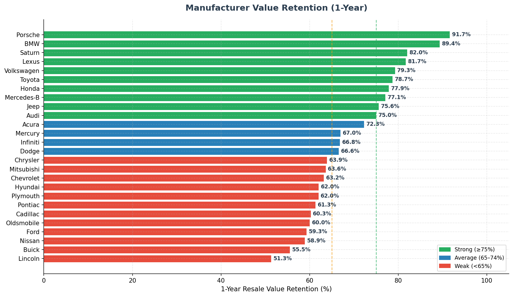
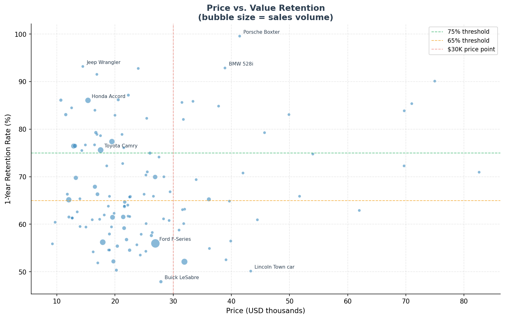
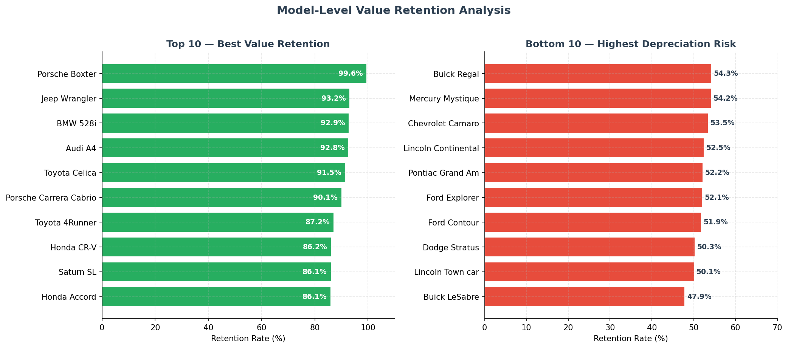
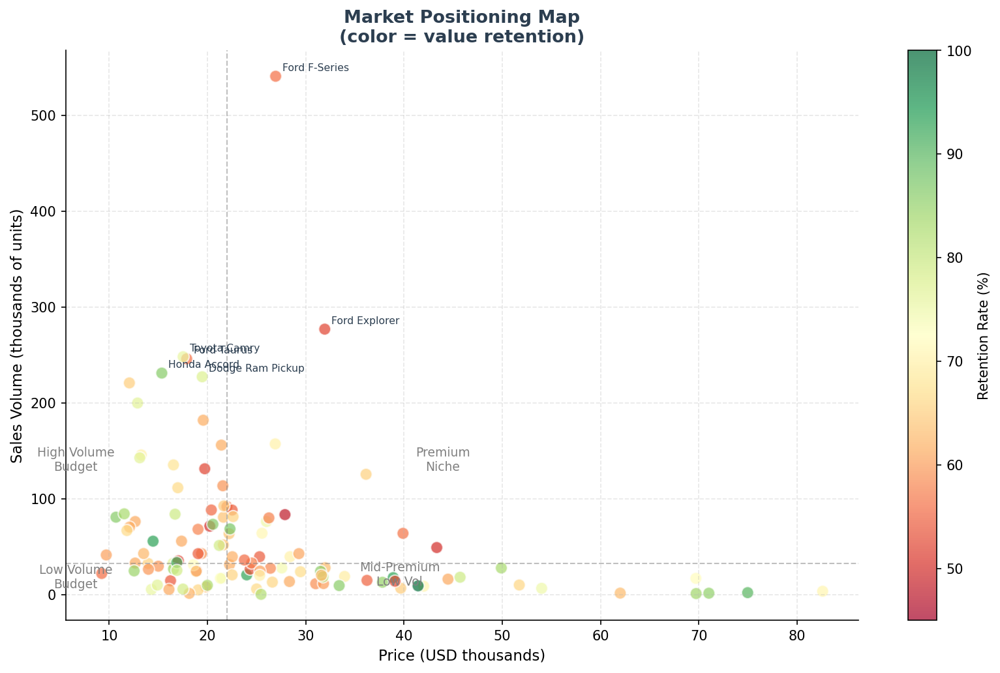
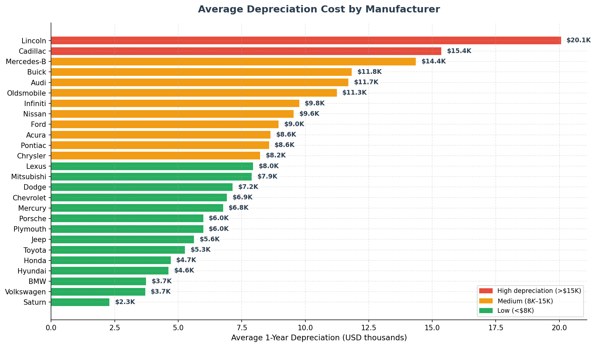

# 🚗 Car Sales Strategy: Value Retention & Market Entry

**Tool:** Python (Pandas, Matplotlib) · **Dataset:** 157 models · 30 manufacturers
**Focus:** Which cars hold their value — and what that means for buyers, fleet managers, and market entrants

---

## Dataset Overview

| Attribute | Detail |
|-----------|--------|
| Models | 157 car models |
| Manufacturers | 30 brands |
| Variables | Price, 1-year resale value, sales volume, horsepower, fuel efficiency, engine size |
| Price range | $9.2K – $85.5K |
| Sales range | 100 – 540,600 units |
| Total market volume | ~8.3 million units |

**Key metric — Retention Rate:**
`Retention Rate (%) = (1-Year Resale Value / Original Price) × 100`
A 75% retention rate means a car loses 25% of its value in one year.

---

## Files

| File | Description |
|------|-------------|
| `Car_sales_row_data.csv` | Raw dataset |
| `analysis.py` | Full Python analysis — generates all 5 charts |
| `charts/` | All generated chart images |

---

## Key Findings

### 1. Value Retention by Manufacturer



**Strong performers (≥75% retention):** Porsche, BMW, Saturn, Lexus, Volkswagen, Toyota, Honda, Mercedes-Benz, Jeep, Audi
**Weak performers (<65% retention):** Ford, Nissan, Buick, Lincoln, Oldsmobile

| Tier | Manufacturers | Avg Retention |
|------|--------------|---------------|
| Premium-hold | Porsche, BMW | ~90% |
| Reliable hold | Lexus, Toyota, Honda, VW | ~78–82% |
| Average | Jeep, Audi, Acura, Mercury | ~67–76% |
| High depreciation | Ford, Nissan, Buick, Lincoln | ~51–59% |

> **Insight:** Price alone does not predict retention. Saturn (avg $12.5K) retains 82% — outperforming Cadillac ($38.8K, 60%). Brand loyalty and perceived reliability matter more than sticker price.

---

### 2. Price vs. Value Retention



- **No strong linear relationship** between price and retention — expensive cars depreciate as fast as cheap ones if the brand lacks prestige or demand.
- **Sweet spot models** (high retention + high sales): Toyota Camry, Honda Accord, Honda CR-V — affordable, high-volume, strong resale.
- **Luxury trap**: Lincoln Continental ($39.1K, 52.5%) and Cadillac DeVille lose more in absolute dollars than economy cars.

---

### 3. Top & Bottom Models



**Top 10 by retention:**

| Model | Price | Resale | Retention |
|-------|-------|--------|-----------|
| Porsche Boxter | $41.4K | $41.2K | **99.6%** |
| Jeep Wrangler | $14.5K | $13.5K | 93.2% |
| BMW 528i | $38.9K | $36.1K | 92.9% |
| Audi A4 | $24.0K | $22.3K | 92.8% |
| Toyota Celica | $16.9K | $15.4K | 91.5% |
| Porsche Carrera Cabrio | $75.0K | $67.5K | 90.1% |
| Toyota 4Runner | $22.3K | $19.4K | 87.2% |
| Honda CR-V | $20.6K | $17.7K | 86.2% |
| Saturn SL | $10.7K | $9.2K | 86.1% |
| Honda Accord | $15.3K | $13.2K | 86.1% |

**Bottom 10 by retention (highest depreciation risk):**

| Model | Price | Resale | Retention | Loss |
|-------|-------|--------|-----------|------|
| Buick LeSabre | $27.9K | $13.4K | 47.9% | -$14.5K |
| Lincoln Town Car | $43.3K | $21.7K | 50.1% | -$21.6K |
| Dodge Stratus | $20.2K | $10.2K | 50.3% | -$10.0K |
| Ford Contour | $17.0K | $8.8K | 51.9% | -$8.2K |
| Ford Explorer | $31.9K | $16.6K | 52.1% | -$15.3K |

> **Insight:** The Lincoln Town Car loses $21,600 in one year — nearly the full price of a Honda Accord. For fleet buyers, this difference compounds dramatically across a vehicle fleet.

---

### 4. Market Positioning Map



Four market quadrants emerge:

| Quadrant | Characteristics | Examples |
|----------|----------------|---------|
| **High Volume / Budget** | Mass-market, affordable, high retention | Honda Civic, Toyota Camry, Ford Focus |
| **Premium Niche** | High price, low volume, strong retention | Porsche, BMW, Lexus |
| **Mid-Premium / Low Volume** | High price, moderate volume, mixed retention | Lincoln, Cadillac |
| **Budget / Low Volume** | Niche economy, variable retention | Saturn, Plymouth |

> **For market entrants:** Competing in the High Volume / Budget quadrant requires scale and brand trust. Premium Niche requires established prestige. The least competitive opening is Mid-Premium — where retention is weaker, volume is low, and incumbents are vulnerable.

---

### 5. Depreciation Cost by Manufacturer



| Tier | Manufacturers | Avg 1-yr Loss |
|------|--------------|---------------|
| High (>$15K) | Lincoln, Porsche, Jaguar, Cadillac | $15K–$22K |
| Medium ($8K–$15K) | BMW, Mercedes, Audi, Infiniti | $8K–$14K |
| Low (<$8K) | Saturn, Hyundai, Honda, Toyota | $2K–$6K |

> **Note:** Porsche appears in "high depreciation cost" because its cars are expensive — but its **retention rate** is 91.7%. Context matters: a $41K car losing $3K is very different from a $25K car losing the same amount.

---

## Strategic Recommendations

### For individual buyers
- **Best value for money:** Honda Accord, Toyota Camry, Jeep Wrangler — high retention at moderate prices
- **Avoid if resale matters:** Lincoln, Buick, Ford Explorer — lose 40–50% of value in year one

### For fleet & leasing companies
- **Prioritize Toyota, Honda, BMW** — lowest total cost of ownership when resale is factored in
- **Avoid domestic luxury (Lincoln, Cadillac)** — steep depreciation destroys fleet ROI

### For market entrants
- **Volume strategy:** Enter the $15K–$25K range with a Toyota/Honda-like reliability proposition — retention is the differentiator, not price
- **Niche strategy:** Target the $30K–$50K premium segment where Porsche/BMW operate — requires strong brand identity but offers pricing power and loyal buyers

---

## How to Run

```bash
pip install matplotlib numpy
python3 analysis.py
```

Charts are saved to the `charts/` directory.

---

## Tech Stack

- **Python** — data processing & analysis
- **Matplotlib** — all visualizations
- **NumPy** — statistical calculations
