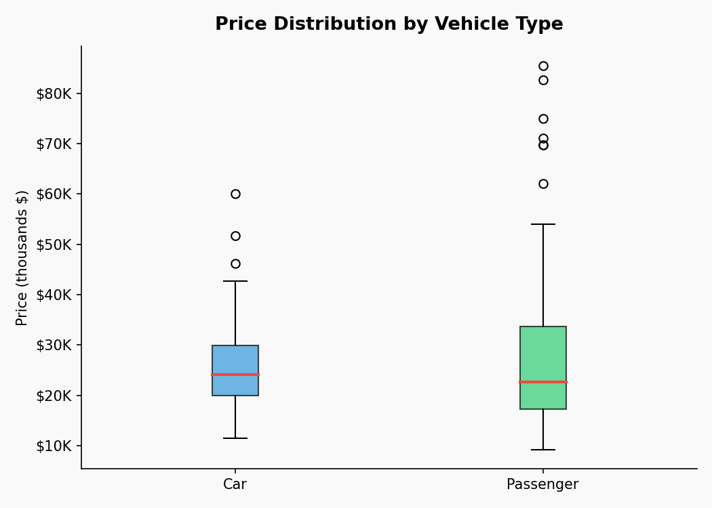
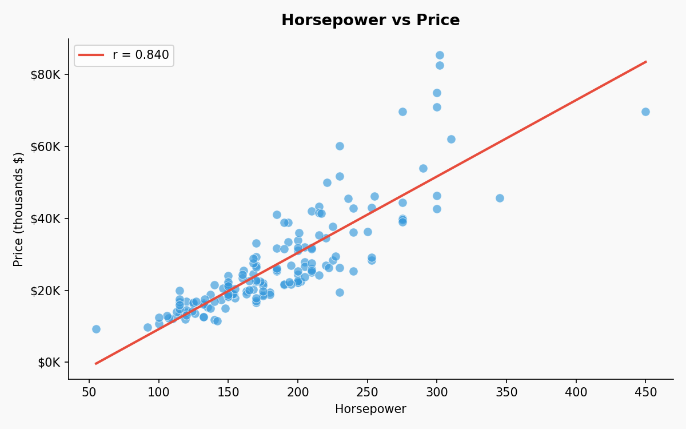
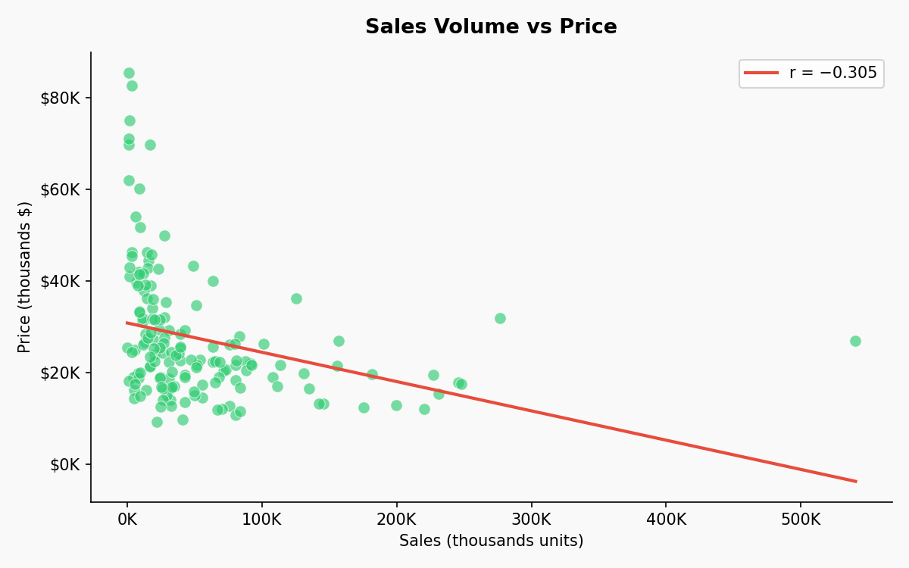

# Car Sales Analysis Report (Python)

> Portfolio-ready mini project: data quality checks, descriptive analytics, correlations, and visuals.

## 1) Project overview
This project analyzes a car sales dataset (**157 rows**, **16 columns**) and produces:
- Data quality summary (missing values)
- Top manufacturers by total sales
- Average price by vehicle type
- Correlation checks (Horsepower↔Price, Sales↔Price)
- Visualizations (bar, boxplot, scatter)

**Dataset file:** `Car_sales_row_data.csv`  
**Original analysis script:** `analysis.py`

## 2) Dataset & columns
The dataset contains manufacturer/model info and numeric features such as sales, price, horsepower, engine size, and fuel efficiency.

### Numeric columns analyzed
`Sales_in_thousands`, `__year_resale_value`, `Price_in_thousands`, `Engine_size`, `Horsepower`, `Fuel_efficiency`, `Power_perf_factor`

## 3) Data quality
| Metric | Missing values |
|---|---:|
| `Sales_in_thousands` | 0 |
| `__year_resale_value` | 36 |
| `Price_in_thousands` | 2 |
| `Engine_size` | 1 |
| `Horsepower` | 1 |
| `Fuel_efficiency` | 3 |
| `Power_perf_factor` | 2 |

**Note:** The largest missingness is in `__year_resale_value` (common in real-world resale datasets).

## 4) Key results

### Top manufacturers by total sales
| Rank | Manufacturer | Total sales (thousands) |
|---:|---|---:|
| 1 | Ford | 2022.63 |
| 2 | Dodge | 910.15 |
| 3 | Toyota | 740.21 |
| 4 | Honda | 592.67 |
| 5 | Chevrolet | 554.37 |
| 6 | Nissan | 399.63 |
| 7 | Pontiac | 370.53 |
| 8 | Jeep | 293.15 |
| 9 | Buick | 242.02 |
| 10 | Mercury | 238.00 |

### Average price by vehicle type
| Vehicle type | Avg price (thousands) |
|---|---:|
| Car | 26.32 |
| Passenger | 27.76 |

### Correlations (pairwise complete)
- **Horsepower vs Price:** r = **0.840** (n=155) → strong positive relationship  
- **Sales vs Price:** r = **-0.305** (n=155) → weak negative relationship

## 5) Visualizations

### 5.1 Top 10 manufacturers by sales


### 5.2 Price distribution by vehicle type


### 5.3 Horsepower vs price


### 5.4 Price vs sales


## 6) Business interpretation
- **Demand & pricing:** Sales vs price is **negative** in this dataset (r≈-0.30), suggesting lower-priced cars tend to sell more units (volume effect).  
- **Performance & pricing:** Horsepower vs price is **strong positive** (r≈0.84), which is consistent with higher performance being priced higher.  
- **Manufacturer focus:** Manufacturers like **Ford** and **Dodge** dominate sales volume; they’re good benchmarks for product mix and pricing strategy.

## 7) Limitations & next steps
**Limitations**
- Correlation ≠ causation (other variables likely drive both sales and price).
- Some columns have missing values (especially resale value).
- Only two vehicle types appear here; results may not generalize.

**Next steps**
- Add multivariate modeling (e.g., regression predicting price or sales).
- Segment analysis by manufacturer or vehicle type.
- Handle outliers (winsorization) and compare results.
- Time-based analysis if you have launch years or monthly sales history.

## 8) Reproducibility
If you want to keep the project lightweight:
- The original `analysis.py` uses only the Python standard library.
- Visualizations in this report were generated with **pandas + matplotlib**.

### How to run the original analysis script
```bash
python analysis.py
```

## Appendix A — Original script (`analysis.py`)
```python
"""Python data analysis project based on car sales CSV data.

Uses only the Python standard library so it runs in minimal environments.
"""

from __future__ import annotations

import csv
import math
from collections import defaultdict
from pathlib import Path

OUTPUT_DIR = Path(__file__).resolve().parent
DATA_PATH = OUTPUT_DIR / "Car_sales_row_data.csv"

NUMERIC_COLUMNS = [
    "Sales_in_thousands",
    "__year_resale_value",
    "Price_in_thousands",
    "Engine_size",
    "Horsepower",
    "Fuel_efficiency",
    "Power_perf_factor",
]


def to_float(value: str):
    if value is None:
        return None
    value = value.strip()
    if value == "":
        return None
    try:
        return float(value)
    except ValueError:
        return None


def mean(values):
    return sum(values) / len(values) if values else None


def pearson(x, y):
    if len(x) != len(y) or len(x) < 2:
        return None
    mx, my = mean(x), mean(y)
    num = sum((a - mx) * (b - my) for a, b in zip(x, y))
    den_x = math.sqrt(sum((a - mx) ** 2 for a in x))
    den_y = math.sqrt(sum((b - my) ** 2 for b in y))
    if den_x == 0 or den_y == 0:
        return None
    return num / (den_x * den_y)


def load_rows(path: Path):
    with path.open(newline="", encoding="utf-8-sig") as f:
        return list(csv.DictReader(f))


def run_analysis():
    rows = load_rows(DATA_PATH)

    missing_counts = {col: 0 for col in NUMERIC_COLUMNS}
    by_maker_sales = defaultdict(float)
    by_type_price = defaultdict(list)

    horsepower, sales = [], []
    aligned_hp, aligned_price_for_hp = [], []

    for row in rows:
        maker = row["Manufacturer"]
        vtype = row["Vehicle_type"]

        sales_val = to_float(row["Sales_in_thousands"])
        price_val = to_float(row["Price_in_thousands"])
        hp_val = to_float(row["Horsepower"])

        for col in NUMERIC_COLUMNS:
            if to_float(row.get(col, "")) is None:
                missing_counts[col] += 1

        if sales_val is not None:
            by_maker_sales[maker] += sales_val
            sales.append(sales_val)

        if price_val is not None:
            by_type_price[vtype].append(price_val)

        if hp_val is not None and price_val is not None:
            aligned_hp.append(hp_val)
            aligned_price_for_hp.append(price_val)

    # align sales-price for correlation
    aligned_sales, aligned_price = [], []
    for row in rows:
        s = to_float(row["Sales_in_thousands"])
        p = to_float(row["Price_in_thousands"])
        if s is not None and p is not None:
            aligned_sales.append(s)
            aligned_price.append(p)

    top_manufacturers = sorted(by_maker_sales.items(), key=lambda kv: kv[1], reverse=True)[:10]
    avg_price_by_type = {k: mean(v) for k, v in by_type_price.items() if v}

    corr_hp_price = pearson(aligned_hp, aligned_price_for_hp)
    corr_sales_price = pearson(aligned_sales, aligned_price)

    summary_lines = [
        "# Python Data Analysis: Car Sales Database",
        "",
        f"- Total rows analyzed: **{len(rows)}**",
        f"- Columns analyzed: **{len(rows[0]) if rows else 0}**",
        "",
        "## Data Quality (Missing Values in Numeric Columns)",
    ]
    for col, count in missing_counts.items():
        summary_lines.append(f"- {col}: {count} missing")

    summary_lines.extend(["", "## Top 10 Manufacturers by Total Sales (in thousands)"])
    for i, (maker, total_sales) in enumerate(top_manufacturers, 1):
        summary_lines.append(f"{i}. {maker}: {total_sales:.2f}")

    summary_lines.extend(["", "## Average Price by Vehicle Type (in thousands)"])
    for vtype, avg_p in sorted(avg_price_by_type.items()):
        summary_lines.append(f"- {vtype}: {avg_p:.2f}")

    summary_lines.extend([
        "",
        "## Correlation Insights",
        f"- Horsepower vs Price correlation: {corr_hp_price:.3f}" if corr_hp_price is not None else "- Horsepower vs Price correlation: not available",
        f"- Sales vs Price correlation: {corr_sales_price:.3f}" if corr_sales_price is not None else "- Sales vs Price correlation: not available",
        "",
        "## Business Takeaways",
        "- Focus marketing on top-selling manufacturers and benchmark their model mix.",
        "- Keep separate pricing strategy by vehicle type because average prices differ significantly.",
        "- The negative sales-vs-price correlation suggests lower-priced models tend to sell more volume.",
    ])

    summary_path = OUTPUT_DIR / "insights.md"
    summary_path.write_text("\n".join(summary_lines), encoding="utf-8")

    top_path = OUTPUT_DIR / "top_manufacturers.csv"
    with top_path.open("w", newline="", encoding="utf-8") as f:
        w = csv.writer(f)
        w.writerow(["rank", "manufacturer", "total_sales_in_thousands"])
        for i, (maker, total_sales) in enumerate(top_manufacturers, 1):
            w.writerow([i, maker, round(total_sales, 3)])

    print(f"Wrote {summary_path}")
    print(f"Wrote {top_path}")


if __name__ == "__main__":
    run_analysis()
```

## Appendix B — Generated text summary (`insights.md`)
```markdown
# Python Data Analysis: Car Sales Database

- Total rows analyzed: **157**
- Columns analyzed: **16**

## Data Quality (Missing Values in Numeric Columns)
- Sales_in_thousands: 0 missing
- __year_resale_value: 36 missing
- Price_in_thousands: 2 missing
- Engine_size: 1 missing
- Horsepower: 1 missing
- Fuel_efficiency: 3 missing
- Power_perf_factor: 2 missing

## Top 10 Manufacturers by Total Sales (in thousands)
1. Ford: 2022.64
2. Dodge: 910.15
3. Toyota: 740.21
4. Honda: 592.67
5. Chevrolet: 554.37
6. Nissan: 399.63
7. Pontiac: 370.53
8. Jeep: 293.15
9. Buick: 242.02
10. Mercury: 238.00

## Average Price by Vehicle Type (in thousands)
- Car: 26.32
- Passenger: 27.76

## Correlation Insights
- Horsepower vs Price correlation: 0.840
- Sales vs Price correlation: -0.305

## Business Takeaways
- Focus marketing on top-selling manufacturers and benchmark their model mix.
- Keep separate pricing strategy by vehicle type because average prices differ significantly.
- The negative sales-vs-price correlation suggests lower-priced models tend to sell more volume.

```
