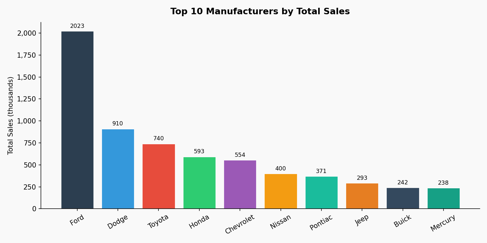

# 🚗 Car Sales Data Analysis (Python)

A data analysis project using a car sales dataset (**157 rows, 16 columns**) to explore sales patterns, pricing, and performance metrics.  
Includes a full Markdown report with charts and reproducible steps.

## Highlights
- ✅ Data quality checks (missing values summary)
- 📊 Top manufacturers by total sales
- 💰 Price comparison by vehicle type
- 🔎 Correlations:
  - Horsepower ↔ Price
  - Price ↔ Sales
- 🖼️ Visualizations (bar chart, boxplot, scatter plots with trend lines)

## Report
Read the full report here: **[`Car_Sales_Portfolio_Report.md`](Car_Sales_Portfolio_Report.md)**

## Visuals (preview)

### Top manufacturers by total sales


### Price distribution by vehicle type


### Horsepower vs price


### Price vs sales


## Project structure
```text
.
├─ Car_Sales_Portfolio_Report.md
├─ README.md
├─ analysis.py
├─ Car_sales_row_data.csv
├─ insights.md
├─ top_manufacturers.csv
└─ portfolio_report_assets/
   ├─ fig_top_manufacturers_sales.png
   ├─ fig_price_by_vehicle_type.png
   ├─ fig_horsepower_vs_price.png
   └─ fig_sales_vs_price.png
```

## How to run
### Option A — Run the original script (stdlib-only)
This reproduces the text outputs (`insights.md`, `top_manufacturers.csv`) the script generates.

```bash
python analysis.py
```

### Option B — Regenerate visuals + the portfolio report
The provided report and visuals were generated with `pandas` + `matplotlib`.

```bash
pip install pandas matplotlib
python -c "import pandas as pd; import matplotlib.pyplot as plt; print('Installed ✅')"
```

> If you'd like, I can add a single `make_report.py` so it rebuilds everything (tables + charts + report) with one command.

## Dataset
- File: `Car_sales_row_data.csv`
- Fields include: `Sales_in_thousands`, `Price_in_thousands`, `Horsepower`, `Engine_size`, `Fuel_efficiency`, etc.

## Key findings (summary)
- **Horsepower vs Price** shows a **strong positive** relationship (higher-performance cars tend to be priced higher).
- **Price vs Sales** shows a **negative** relationship (lower-priced cars tend to sell more units in this dataset).
- A small number of manufacturers dominate total sales volume.

## License
Use freely for learning and portfolio purposes. If you publish it, credit the original dataset source if known.

---
**Author:** Anass
